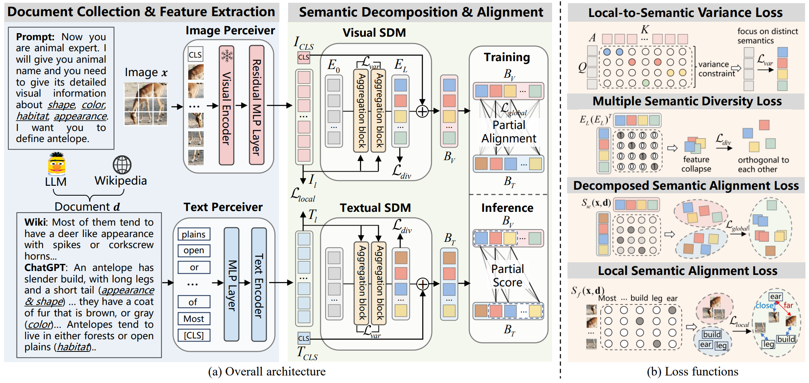

# Visual-Semantic Decomposition and Partial Alignment for Document-based Zero-Shot Learning
* Official PyTorch implementation for paper [**Visual-Semantic Decomposition and Partial Alignment for Document-based Zero-Shot Learning**](https://dl.acm.org/doi/10.1145/3664647.3680829).
* The paper is accepted by ACM MM 2024


## Introduction 
In this work, we propose an **Em**bedding **De**composition and **Part**ial Alignment (**EmDepart**) network to extract multi-view semantic concepts from document and image and accurately align the matching concepts. Specifically, the **S**emantic **D**ecomposition **M**odule (**SDM**) is proposed to generate multi-view semantic embeddings from visual and textual sides, providing the basic concepts for partial alignment. However, the SDM may generate multiple embeddings with a slight variance, resulting in information redundancy, denoted as feature collapse. To alleviate this issue, we propose the local-to-semantic variance loss to capture unique local details and multiple semantic diversity loss to make each embedding orthogonal to others. Subsequently, we rely on the semantic similarity of every visual and textual view embedding pair to model the partial association. Two losses are introduced to partially align these pairs according to their semantic relevance at the view and word-to-patch levels. Moreover, a novel score is applied to filter out unmatched information to measure semantic similarity accurately at the inference. Since some fine-grained categories are less described in the encyclopedia, we also design a novel prompt strategy to enrich these documents.

<div align="center">
  
</div>

## Environment Setup

We recommend to install the environment through conda and pip. You should make a new environment with python>=3.8

`conda create -n EmDepart python=3.8`

Next, you can download pytorch from official site, for example:

`conda install pytorch torchvision torchaudio cudatoolkit=11.3 -c pytorch`

Next, run 

`pip install -r requirements.txt` 


## Dataset 

In `run/prepare_data`, we provide `data_split.sh` to download proposed split and `download_dataset.sh` to download AWA2, CUB, and FLO datasets.

## Get Started

We provide `run` which you can run EmDepart in an one-line command.
Notably, you need to replace `--data_root` and `--data_split_root` with your path.
```bash
sh run/AWA2.sh
```
```bash
sh run/CUB.sh
```
```bash
sh run/FLO.sh
```


## Acknowledgement 

This repo benefits from [S-Chamfer](https://github.com/kdwonn/DivE) and [I2DFormer](https://github.com/ferjad/I2DFormer). Thanks for their works.


## Reference

```
@inproceedings{EmDepart,
  author       = {Xiangyan Qu and Jing Yu and Keke Gai and Jiamin Zhuang and Yuanmin Tang and Gang Xiong and Gaopeng Gou and Qi Wu},
  title        = {Visual-Semantic Decomposition and Partial Alignment for Document-based Zero-Shot Learning},
  booktitle    = {Proceedings of the 32nd {ACM} International Conference on Multimedia, {MM} 2024, Melbourne, VIC, Australia, 28 October 2024 - 1 November 2024},
  pages        = {4581--4590},
  publisher    = {{ACM}},
  year         = {2024},
  url          = {https://doi.org/10.1145/3664647.3680829},
  doi          = {10.1145/3664647.3680829},
}
```
